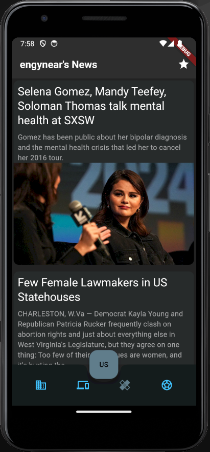
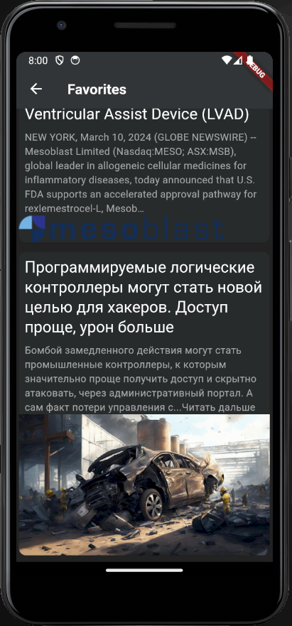

# Новостное приложение ДЗ-2

## Описание
Приложение доработано, переписана структура (теперь декомпозиции на data/domain/ui, нет бизнес-логики в ui).
Добавлена возможность добавление новости в избранное, переписано управление состоянием на Riverpod. 
Добавлен новый экран с избранными новостями. При перезагрузке приложения избранные новости сохраняются, выбранная страна и категория новостей сохраняется.

[Видео-демонстрация](https://disk.yandex.ru/i/uHTVwCC8ajGh7Q)

## Критерии
- Есть актуальное описание ✅
- Есть скриншоты ✅
- Прикреплен [APK-файл](./news.apk) ✅
- Работает на Android ✅

- Реализован механизм сохранения избранных новостных статей (кнопку “нравится” для новости)” ✅

- Реализован новый экран с отображением любимых статей ✅

- Код отформатирован ✅
- Используется Riverpod для управления состоянием UI ✅
- Разделение проекта на слои и декомпозиция логики (Data / Domain / UI и без бизнес-логики в UI) ✅
- Реализовать DI ✅

- Хорошо спроектированная [архитектура](./lib/) ✅